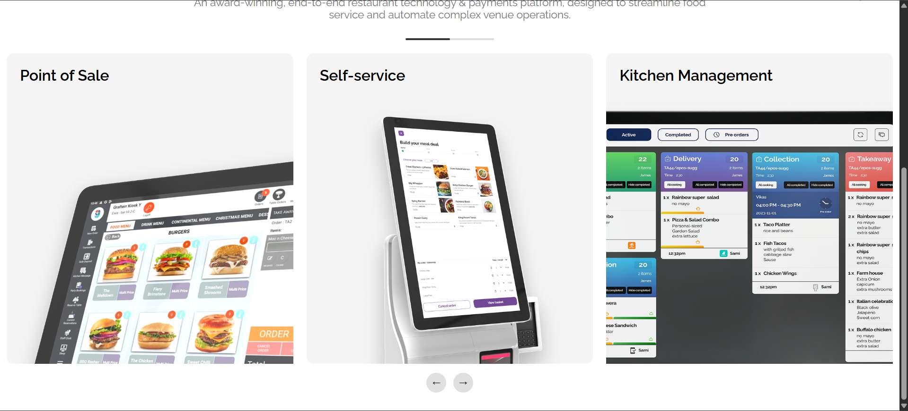

# 🚀 Grafterr Landing Page

A pixel-perfect, fully responsive landing page built as part of a front-end technical assessment.
The project replicates the provided Figma design and follows best practices in modern React development.

---

## 🧰 Tech Stack

- **React 18** (Functional Components + Hooks)
- **CSS3** (Custom styling, no frameworks)
- **JavaScript (ES6+)**
- **Vite** (Build tool)
- **Custom Hooks** (`useContent`, `useCarousel`)

---

## 📦 Setup Instructions

### 1. Clone the repository

```bash
git clone https://github.com/dev-rabin/grafterr-landing.git
cd grafterr-landing
```

### 2. Install dependencies

```bash
npm install
```

### 3. Run development server

```bash
npm run dev
```

### 4. Open in browser

```
http://localhost:5173
```

---

## 🧠 Approach & Architecture

### 🔹 Component-Based Architecture

The application is structured using reusable and modular components:

- `HeroSection` → Landing hero content
- `FeaturesSection` → Features + carousel
- `Carousel` → Custom responsive slider
- `ProductCard` → Individual feature cards
- `UI Components` → Buttons, GradientText, Skeleton loaders

---

### 🔹 Dynamic Data Handling

- All content is stored in `content.json`
- Data is fetched using a **mock API layer** (`api.js`)
- Simulated network delay (1200ms) using `setTimeout`
- No hardcoded UI content

---

### 🔹 Custom Hooks

- `useContent` → Handles API calls, loading, and error states
- `useCarousel` → Manages carousel index and navigation

---

### 🔹 Carousel Implementation

- Responsive behavior:
  - Desktop → 3 items
  - Tablet → 2 items
  - Mobile → 1 item

- Smooth 300ms transitions
- Arrow navigation (prev/next)
- Touch swipe support
- Center-aligned “peek” layout (Figma-style)

---

### 🔹 Loading & Error Handling

- Skeleton loaders for Hero and Features sections
- Error state with retry button
- Smooth transition from loading → content

---

### 🔹 Styling

- Pure CSS (no Tailwind / Bootstrap)
- Gradient text and buttons
- Floating decorative shapes with animation
- Fully responsive (mobile → desktop)

---

## 📱 Features Implemented

- ✅ Pixel-perfect UI based on Figma
- ✅ Fully responsive layout
- ✅ Dynamic content rendering
- ✅ Carousel with swipe support
- ✅ Skeleton loading states
- ✅ Error handling with retry
- ✅ Clean and scalable folder structure

---

## 📸 Screenshots

### 🔹 Hero Section


### 🔹 Features Section


### 🔹 Carousel



> _(Add screenshots inside `/screenshots` folder)_

---

## 📁 Folder Structure

```bash
src/
 ├── components/
 │   ├── ui/
 │   ├── Carousel.jsx
 │   ├── ProductCard.jsx
 │
 ├── sections/
 │   ├── HeroSection.jsx
 │   ├── FeaturesSection.jsx
 │
 ├── hooks/
 │   ├── useContent.js
 │   ├── useCarousel.js
 │
 ├── services/
 │   ├── api.js
 │
 ├── data/
 │   ├── content.json
```

---

## 🌐 Live Demo

👉 https://grafterr-task.netlify.app

---

## 📝 Notes

- All content is dynamically loaded from JSON
- Assumptions (if any) are documented in code comments
- Focus was on **UI accuracy, responsiveness, and clean architecture**

---

## 🙌 Author

**Robin Mandhotia**
Frontend Developer (MERN Stack)

---
